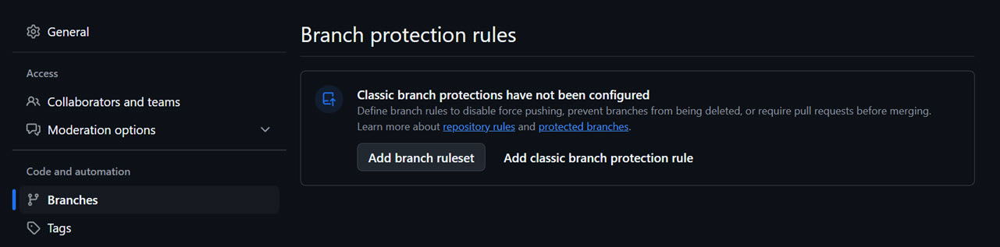

# anan-mesudar: cloud organized

This project is meant to help create and maintain a NIST 800-53 compliant AWS environment. It will include:

- Templates (CloudFormation, Terraform) to build secure reference architecture
- Scripts (Python, bash) to assess current settings and determine corrective actions
- Ticket Integration to ensure all security defects are ticketed for engineering teams
- Reporting on environmental health and defect turnover
- Documentation examples demonstrating how to create actionable content for cloud teams

## Assumptions

What assumptions are held before using this framework?

Examples:

- AWS Organizations is enabled
- Control Tower is enabled and configured with an Audit account
- You read these scripts and templates before deploying them

## Repository Organization

This organization is subject to change, but initially there will be:

```
.
├── assets
│   ├── branch-protection-rules01.jpg
│   └── branch-protection-rules02.jpg
├── config.example
├── config.yaml (local populated version)
├── modules
│   ├── aws_module.py
│   ├── __init__.py
│   ├── jira_module.py
│   └── slack_module.py
├── please.py
├── README.md
└── utils
    ├── config_loader.py
    ├── __init__.py
```

## Rules of engagement

### Software development document

Software development documentation should cover all things version control (including branch naming, comments, commits, pull requests) as well as branching strategy, approval processes, product versioning, and ticketing.

Starting with a solid Software Development LifeCycle (SDLC) process to ensure problems are corrected at the root and a versioned product is produced will make everything easier in the long term. Reduction of repeat corrective actions, less overhead managing convoluted deployment processes, and less confusion about when something broke and was fixed again are all examples of what can come from the upfront work of defining the process.

A basic deployment promotion model used for this reference will be:

GitHub Code Repository
-> If deployment to Development passes, it can be promoted
    -> If deployment to Sandbox passes, it can be promoted
        -> If deployment to QA passes, it can be promoted
            -> If deployment to Staging passes, it can be promoted
                -> Production deployment

Code will be checked for defects as they are added to the repository. Once the code base is approved for promotion, the code can be deployed to a sandbox environment for smoke testing. Defects will be captured back into the GitHub process to allow additional changes if required. Once the first two stages are defect-free and approved, deployment can continue to the next stage. This model will result in many more deployments to the dev/sandbox environments than the production environments.

To upgrade this model, add product versioning. Determine the best way to capture artifacts and at which level to start producing a software bill of materials (SBOM) which will enable references to specific versions of the code that have been approved or failed. Essentially, before a set of code is promoted beyond the sandbox, a product branch would be created with all the successful code and that point in time snapshot would become `version 1.0.0` for example. Then after the next few fixes or features have been successfully integrated into `main`, snapshot `version 1.0.1` and so on. Defining when to increment the values in first, second, or third position will help keep the process organized. For example, adding features may increment the `1.1.0` to `1.2.0` while bugfixes would increment the third integer like `1.1.0` to `1.1.2`. This would allow a running log to exist for all defects and when they were introduced / remediated.

### GitHub

Some rules for effective life in GitHub include:

1. Branch Protection: do not allow commits directly to `main`
2. Branching strategy: agree on and document how feature branches will be named. Examples can include naming the branch after the GitHub Issue ID or a correlated Jira ticket ID. Avoid branches with names like `test`, `temp`, or `bob-dev`.
3. Comment standards: agree on and document how comments should be handled both in code and in `git push` events. For reference, consider pulling some of these standards: https://gist.github.com/tonibardina/9290fbc7d605b4f86919426e614fe692
4. Document Pull Request process: Will you use codeowners / codereviewers or will it be ad-hoc? Document the decision and why for future onboarding.
5. Document LINTING process: Will the code receive a LINT on every `push` or only on `pull request`? Will the output be logged in the comments in GitHub?
6. Document SAST process: Again, will the code receive a static analysis on every `push` or only when going to `pull request`? How will developers know about the issues? Will they be fed back as comments, will tickets be created, or some combination of both?

Reference images for __Branch Protection__ under repository *Settings* tab:




### GitHub Reference Architecture

GitHub Actions have been created for the following scenarios:

**push**

__lint_on_Push__: When a change is pushed to a repository, basic linting will occur. Output is available under GitHub actions.

**pull_request**

__lint_on_pull_request__: When a PR is created, the same LINTing is performed but the results are appended to the Conversation as comments for easier review by developers and approvers.


*Create the following GitHub Actions and complete the documentation*:

.github/workflows/snyk
    - Static Scan the repository via Snyk as an example
    - Findings are fed back into the comments
.github/workflow/smoketest
    - Deploy code in a sandbox capacity
    - Success and Errors are fed back into the comments
